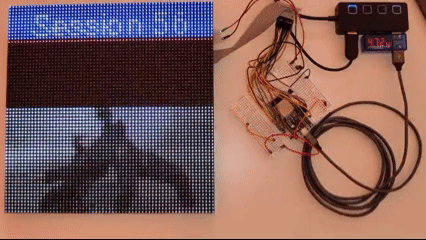
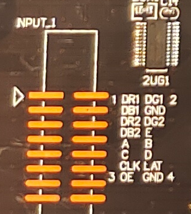
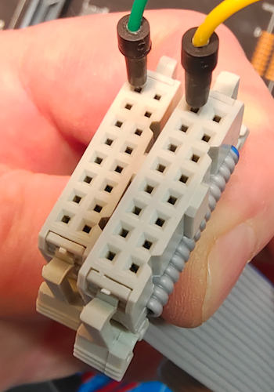
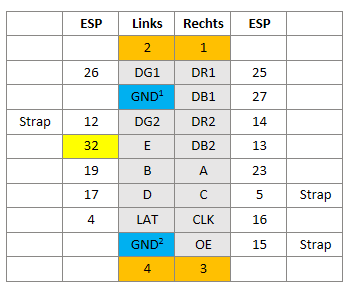
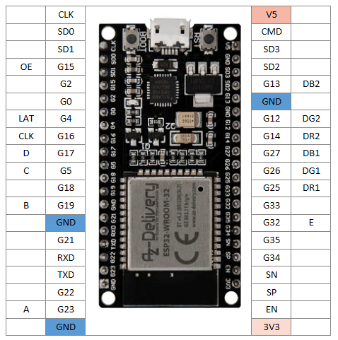

_Updated at [Session 56](https://session.pestilenz.org/)_

# Docker hosted ESPHome

* This repo provides an `esphome.cmd`, which starts the ESPHome Dashboard on the local PC.  
  Dashboard address: <http://localhost:6052/>
* If the repo's root folder is opened in [VSCode](https://code.visualstudio.com/), the [ESPHome extension](https://marketplace.visualstudio.com/items?itemName=ESPHome.esphome-vscode) provides syntax highlighting for the `.yaml` files.

## Bad performance?

Large projects are very slow during compilation (290 vs. 2343 sec).
It's not related to CPU but I/O, if the ESPHome `/config` folder is mounted between Docker and Windows Host.

Solution used in `esphome-fastcompile.cmd`:

* Use a native docker volume for `/config`
* Mount Windows host's folder elsewhere, e.g. at `/mnt/host`
* Copy `*.yaml` over to `config` dir and firmware `*.bin` back

```bash
esphome clean hub75-64x64.yaml
cp /mnt/host/*.yaml . && esphome compile hub75-64x64.yaml
cp /config/.esphome/build/hub75-64x64/.pioenvs/hub75-64x64/firmware.factory.bin /mnt/host/firmware.bin
```

## Usage

* Start new project: `esphome wizard test.yaml`
* Build project: `esphome compile hub75-64x64.yaml`
* Build & upload project: `esphome run template-d1_mini.yaml`
* Run [Dashboard](http://localhost:6052/): `esphome dashboard /config`

## Links

* Install [ESPHome via Docker](https://esphome.io/guides/getting_started_command_line#installation)
* [VSCode Extension](https://github.com/esphome/esphome-vscode)
* [ESPHome Web Installer](https://web.esphome.io/) to flash a given `.bin` via browser connected via `COMx`.
  * If the board has a `BOOT` key, press and hold it while confirming the installation wit `[INSTALL]`.
  * It helps to power off the board before connecting the serial port.
* [CP210x Universal Windows Driver](https://www.silabs.com/software-and-tools/usb-to-uart-bridge-vcp-drivers?tab=downloads) required on Windows@Arm64 to flash Esp32 NodeMPU boards.

### Hub75 Matrix Display

`hub75-64x64.yaml` drives a [64x64 Hub75 1/32-scan panel](https://de.aliexpress.com/item/1005005720691780.html?spm=a2g0o.order_list.order_list_main.5.21ef5c5fzbAAB2&gatewayAdapt=glo2deu) with an ESP32 NodeMCU.



| Input Plug | Related Cable |
|------------|---------------|
|  |  |
| | The marked pins are connected |

| Cable | ESP32 |
|-------|-------|
|  |  |

* Based on [this example](https://github.com/TillFleisch/ESPHome-HUB75-MatrixDisplayWrapper/blob/main/example.yaml)

* GitHub
  * ESPHome wrapper
    [TillFleisch/ESPHome-HUB75-MatrixDisplayWrapper](https://github.com/TillFleisch/ESPHome-HUB75-MatrixDisplayWrapper)

  * HUB75 matrix panel lib for ESP32
    [mrcodetastic/ESP32-HUB75-MatrixPanel-DMA](https://github.com/mrcodetastic/ESP32-HUB75-MatrixPanel-DMA)

  * Another ESPHome wrapper
    [sekureco42/esphome-hub75](https://github.com/sekureco42/esphome-hub75)
