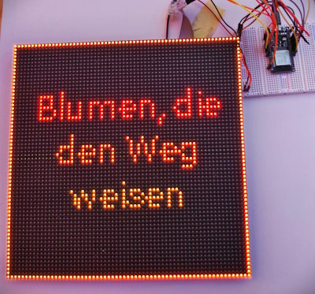

# Docker hosted ESPHome

_(Updated during [👾 Session 56](https://session.pestilenz.org/) in Nov 2025)_

This repo provides scripts to execute dockerized ESPHome commands.

* Use `compile.cmd file.yaml compname` to compile the ESPHome component `compname` defined in the file `file.yaml`.
  Firmware will be available in `bin\compname.bin`.
* Use `bash.cmd` to start a WSL bash shell, where the `esphome` command is available.
* Frameworks, libraries, and temp. PlatformIO data are cached in docker volumes `esphome-config` and `esphome-platformio` to speed up compilation and prevent repeated downloads of those large libraries.
  The volumes can be deleted to force a fresh build.
* Use `dashboard.cmd` to start the ESPHome Dashboard at: <http://localhost:6052/>.
* If the repo's root folder is opened in [VSCode](https://code.visualstudio.com/), the [ESPHome extension](https://marketplace.visualstudio.com/items?itemName=ESPHome.esphome-vscode) provides syntax highlighting for the `.yaml` files.

## WSL Performance Tweak

Mounting a local windows folder into a WSL2 based docker container and compiling within this folder leads to a massive performance drop (factor 10) because of many I/O operations during the build.
The scripts solve this by mounting the local folder to `/mnt/host` and copying sources and firmware back and forth. Temp. compilation files are stored in docker volumes.

## Usage

* Compile: `compile.cmd file.yaml name`
* ESPHome bash: `bash.cmd`

Selected `esphome` commands to be used in the ESPHome `bash`:

* Start new project: `esphome wizard project.yaml`
* Build project: `esphome compile project.yaml`
* Cleanup temp. files of project: `esphome clean project.yaml`
* Build project, OTA upload, start logs: `esphome run project.yaml`
* Run [Dashboard](http://localhost:6052/) from `/config` folder: `esphome dashboard /config`

## Links

* Install [ESPHome via Docker](https://esphome.io/guides/getting_started_command_line#installation)
* [VSCode Extension](https://github.com/esphome/esphome-vscode)
* [ESPHome Web Installer](https://web.esphome.io/) to flash a given `.bin` via browser connected via `COMx`.
  * If the board has a `BOOT` key, press and hold it while confirming the installation wit `[INSTALL]`.
  * It helps to power off the board before connecting the serial port.
    Optionally holds down the `BOOT` key while connecting the board to the power source.
  * Try to connect `GPIO0` and `GND` if the board has no `BOOT` key, [details here](https://esphome.io/guides/physical_device_connection/#connecting-to-the-esp).
* [CP210x Universal Windows Driver](https://www.silabs.com/software-and-tools/usb-to-uart-bridge-vcp-drivers?tab=downloads) required on Windows@Arm64 to flash Esp32 NodeMPU boards.

## Projects

The root folder of this repo contains several ESPHome projects (`*.yaml`) which can be compiled with the above scripts.

### Hub75 Matrix Display

`hub75-64x64.yaml` drives a [64x64 Hub75 1/32-scan panel](https://de.aliexpress.com/item/1005005720691780.html?spm=a2g0o.order_list.order_list_main.5.21ef5c5fzbAAB2&gatewayAdapt=glo2deu) with an ESP32 NodeMCU.

| Input Plug | Related Cable |
|------------|---------------|
|  |  |
| | The marked pins are connected |

| Cable | ESP32 |
|-------|-------|
|  |  |

* Based on [this example](https://github.com/TillFleisch/ESPHome-HUB75-MatrixDisplayWrapper/blob/main/example.yaml)

* GitHub
  * ESPHome wrapper
    [TillFleisch/ESPHome-HUB75-MatrixDisplayWrapper](https://github.com/TillFleisch/ESPHome-HUB75-MatrixDisplayWrapper)

  * HUB75 matrix panel lib for ESP32
    [mrcodetastic/ESP32-HUB75-MatrixPanel-DMA](https://github.com/mrcodetastic/ESP32-HUB75-MatrixPanel-DMA)

  * Another ESPHome wrapper
    [sekureco42/esphome-hub75](https://github.com/sekureco42/esphome-hub75)

### Framed Utopia

`utopia.yaml` displays random "Utopia" messages on a HUB75 64x64 matrix.
Short, nice, utopic statements - simply to make you smile.

This is basically the ESPHome version of [this project](https://github.com/Esshahn/esp32-dotmatrix-utopia-offline) shared by [Ingo Hinterding](https://github.com/Esshahn).

* [Utopia messages (German)](https://github.com/Esshahn/esp32-dotmatrix-utopia-offline/blob/29ec1e009be6e6e01db2c21299e1946cc10cb018/esp32-dotmatrix-utopia-offline.ino#L41)

### Casalux LED Bar

`led.yaml` drives a "Casalux LED Bar" on a ESP32 C3 Super Mini.

More details in the Github project [ramdacxp/lichtleiste](https://github.com/ramdacxp/lichtleiste).
